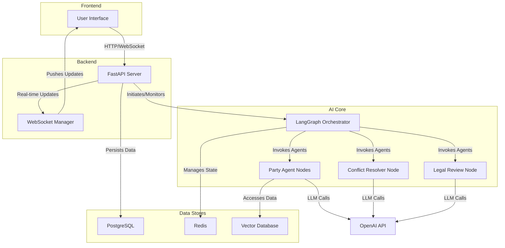

# Contract Lifecycle Management (CLM) Project

This project is an AI-powered, multi-party contract amendment orchestration system designed to automate and streamline the process of negotiating and amending legal agreements. It leverages LangGraph and a multi-agent architecture to simulate the roles of different parties, enabling automated evaluation, conflict resolution, and consensus-building.

## Table of Contents

- [Problem Statement](#problem-statement)
- [Functional Requirements](#functional-requirements)
- [Non-Functional Requirements](#non-functional-requirements)
- [Core Entities and APIs](#core-entities-and-apis)
- [High-Level System Design](#high-level-system-design)
- [Deep Dives](#deep-dives)
- [Conclusion](#conclusion)

## Problem Statement

Amending legal contracts involving multiple stakeholders is traditionally a manual, time-consuming, and inefficient process. Key challenges include:

- **Coordination Overhead**: Aligning schedules and feedback from various parties (e.g., legal, finance, operations) is complex and leads to delays.
- **Manual Reviews**: Each party must manually review proposed changes against their internal policies, risk tolerance, and business objectives, a process prone to human error and inconsistency.
- **Conflict Resolution**: Disagreements and conflicting interests often result in lengthy negotiation cycles, requiring extensive back-and-forth communication.
- **Lack of Transparency**: Tracking the status of reviews, approvals, and counter-proposals across all parties is difficult, leading to a lack of visibility into the overall progress.

This project aims to solve these issues by creating an automated system that orchestrates the entire amendment lifecycle, reducing manual effort, accelerating timelines, and ensuring all party constraints are systematically checked.

## Functional Requirements

- **Workflow Initiation**: Users can initiate an amendment by providing the original contract, proposed changes, and a list of participating parties with their specific configurations.
- **Multi-Agent Evaluation**: Each party is represented by an AI agent that autonomously evaluates proposed changes based on its unique policies (e.g., risk tolerance, budget limits, required clauses).
- **Conflict Detection**: The system automatically identifies when parties' evaluations result in conflicting decisions (e.g., one approves while another rejects).
- **Automated Conflict Resolution**: An AI-powered mediator agent analyzes conflicts and proposes compromise solutions to help parties reach a consensus.
- **Legal Review Node**: For complex or high-risk amendments, the workflow can include a dedicated legal review step to ensure compliance and mitigate legal exposure.
- **Final Document Generation**: Upon reaching a consensus, the system generates the final amended contract document incorporating all approved changes.
- **Real-Time Monitoring**: A FastAPI backend provides REST APIs and WebSocket connections to monitor the real-time status of any ongoing amendment workflow.
- **Workflow Management**: Users can list, inspect, and cancel active amendment processes via API endpoints.

## Non-Functional Requirements

- **Scalability**: The system is designed to handle multiple concurrent amendment workflows, leveraging asynchronous processing for long-running tasks.
- **Modularity**: The architecture is highly modular. The graph-based structure allows new nodes (e.g., specialized review steps) or agents to be added with minimal changes.
- **Extensibility**: The system can be extended to integrate with different Large Language Models (LLMs), vector stores, or databases as needed.
- **Reliability**: The workflow includes error handling and retry mechanisms to manage transient failures, ensuring the process can recover and continue.
- **Traceability**: Integration with LangSmith provides full traceability, allowing every step, decision, and agent interaction within the workflow to be logged and audited.

## Core Entities and APIs

### Core Entities (from SQLAlchemy models)
- **Contract**: Stores title, content, parties, status, and versions.
- **Amendment**: Tracks workflow ID, proposed changes, party responses, conflicts, and final document.
- **Party**: Organization details, policies (e.g., risk_tolerance), and contacts.
- **WorkflowEvent**: Audit logs for node executions, errors, and status changes.
- **ContractVersion**: Versioned documents with hashes and diffs.
- **NotificationLog**: Logs for emails/WebSockets.

### Main Components
- **Orchestrator**: The central component, built with LangGraph, that defines and manages the state machine for the amendment workflow.
- **Party Agent Node**: An AI agent representing a single party. It encapsulates the party's policies and uses an LLM to perform detailed analysis (contractual, business, legal, risk) and make decisions.
- **Conflict Resolver Node**: An agent responsible for mediating disagreements between parties by proposing neutral and mutually beneficial solutions.
- **Legal Review Node**: A specialized node for in-depth legal analysis of the proposed changes.
- **Workflow State**: A Pydantic object that maintains the complete state of the amendment process, including proposed changes, party responses, conflicts, and the final document.

### Key APIs

The application exposes a RESTful API built with FastAPI:

- `POST /api/v1/amendments/initiate`: Starts a new contract amendment workflow.
- `GET /api/v1/amendments/{workflow_id}/status`: Retrieves the current status of a workflow, including the status of each party.
- `GET /api/v1/amendments`: Lists all amendment workflows with optional filtering.
- `DELETE /api/v1/amendments/{workflow_id}`: Cancels an active workflow.
- `WS /ws/{workflow_id}`: A WebSocket endpoint for receiving real-time updates on a workflow's progress.

## High-Level System Design

The system is composed of a FastAPI backend that serves the API and a LangGraph-powered core that runs the amendment workflows.

1.  **API Layer (FastAPI)**: Exposes endpoints for clients to interact with the system. It handles incoming requests, validates data, and initiates background tasks to run the LangGraph workflows.
2.  **Orchestration Layer (LangGraph)**: This is the heart of the system. The amendment process is modeled as a state graph where each node represents a specific step (e.g., `evaluate_changes`, `resolve_conflicts`, `legal_review`). Edges are conditional, directing the flow based on the outcomes of each step (e.g., if conflicts are detected, move to the `resolve_conflicts` node).
3.  **Agent Layer**: AI agents, powered by LLMs like GPT-4, operate within the graph nodes. Each agent is given a specific role, context, and set of tools to perform its function.
4.  **Data and State Management**: 
    - **PostgreSQL (via SQLAlchemy)**: Stores persistent data such as contract details and the high-level status of amendment workflows.
    - **Redis**: Manages the real-time state of each active LangGraph workflow.
    - **Vector Stores (Weaviate/Neo4j)**: Can be used for semantic search over contract clauses or related legal documents (though current implementation details are abstract).

## Deep Dives

### Party Agent Evaluation Process

Each party agent performs a multi-faceted evaluation of the proposed changes, broken down into four key analyses:

1.  **Contract Analysis**: The agent analyzes the proposed changes in the context of the original contract. It identifies favorable, unfavorable, and neutral changes from the party's perspective.
2.  **Business Impact Assessment**: It evaluates the financial, operational, and strategic impact of the changes on the party's business.
3.  **Legal & Compliance Evaluation**: The agent assesses legal risks, compliance issues, and the enforceability of the proposed terms.
4.  **Risk Assessment**: It performs a comprehensive risk analysis (financial, operational, reputational) and determines if the changes fall within the party's predefined risk tolerance.

Based on a weighted score from these analyses, the agent makes a final recommendation: `approved`, `rejected`, or `requested_changes`.

### Conflict Resolution Mechanism

When parties return conflicting evaluations, the `Conflict Resolver` node is activated. This agent receives the conflicting viewpoints and rationales as input. Its goal is to generate a neutral, data-driven compromise. It might suggest alternative language, modified terms, or a middle-ground solution that balances the interests of the conflicting parties. The proposed resolution is then sent back to the parties for a new round of evaluation.

## Conclusion

This project demonstrates a powerful application of multi-agent systems and LangGraph to solve a complex, real-world business problem. By automating contract amendment workflows, it offers a scalable, reliable, and transparent solution that can significantly reduce manual effort, minimize human error, and accelerate business-critical negotiations. The modular design provides a strong foundation for future extensions, such as integrating more specialized AI agents, supporting a wider range of legal documents, and connecting with other enterprise systems.
